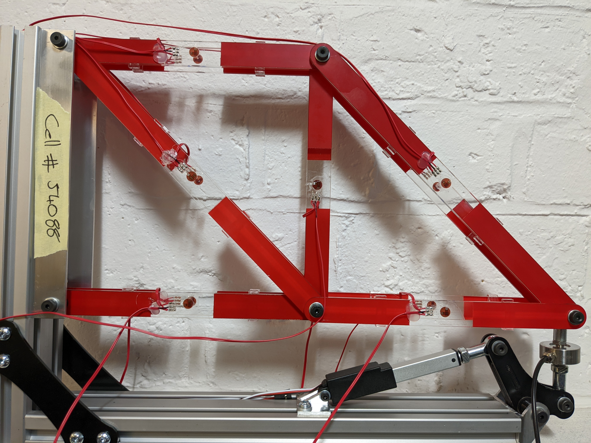

# truss

This remote lab is still in ACTIVE DEVELOPMENT. 

## Contents

- Firmware '''./fw'''
- Hardware '''./hw'''
- UI '''./ui'''

## Introduction

The truss remote laboratory has been designed for use with Structural Engineering and Engineering Design courses at the University of Edinburgh. The truss consists of 6 members, each with a full-bridge strain gauge arrangement using two biaxial strain gauges ([Kyowa KFGS-2-120-D16-11](./hw/docs/)). Strain gauge voltages are converted to digital signals using the [HX711 ADC](./hw/docs/) and this [HX711 library](https://www.arduino.cc/reference/en/libraries/hx711-arduino-library/) is used to read and tare the gauges. The truss is loaded using a [linear servo](./hw/docs/). 

## Firmware

The truss remote lab has been designed around the Arduino Nano 33 IoT. The firmware uses a state machine with 11 states, including reading, writing, taring and resetting strain gauges and moving the linear actuator. A single microcontroller performs both reading and writing of data. The state machine will remain in the READ state until a user command to change state. Upon performing that state the state machine will return to READ. The required libraries are included [here](./fw/libraries/). 

The firmware sends and receives JSON messages, eg:

Mode control, received from UI through Serial (for all commands see [SerialCommands](./fw/MiniTruss/):

'''
{"set": "position", "to": value} 
{"set": "mode", "to": "move"} 
{"set": "mode", "to":"tare_all"} 
'''

Sending data to UI through Serial:
'''
{"load_cell":"20.0", "gauge_1": "100.0", "gauge_2": "100.0", "gauge_3": "100.0", "gauge_4": "100.0", "gauge_5": "100.0", "gauge_6": "100.0", "state":"1", "pos":"10"}
'''

## PCB

The PCB requires a 12V input and provides output voltages for different components: 10V (load cell excitation voltage), 6V (linear actuator power) and 5V (strain gauge excitation voltage). Details of jumper requirements for setting up the PCB in different modes will be added (TODO).

## Hardware

The [Actuonix L16](./hw/docs/Actuonix+L16+Datasheet.pdf) linear actuator uses the custom library LinearServo for setting its position. It has a 50mm stroke length, but is limited in this remote lab to a maximum of 20% extension (providing around 150N of load on the truss).
