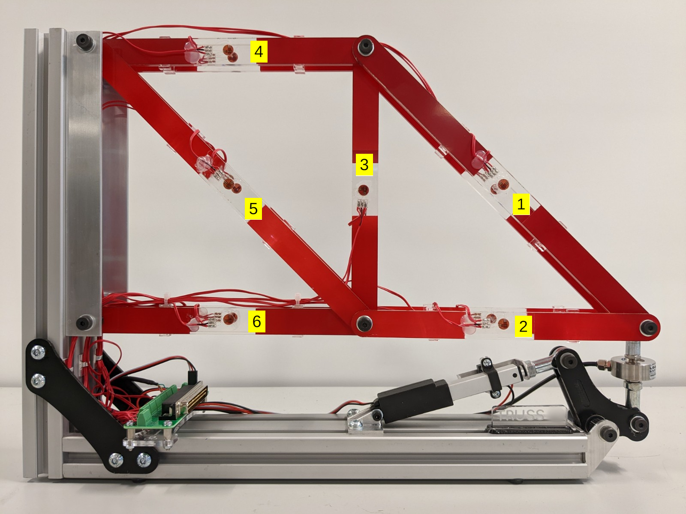
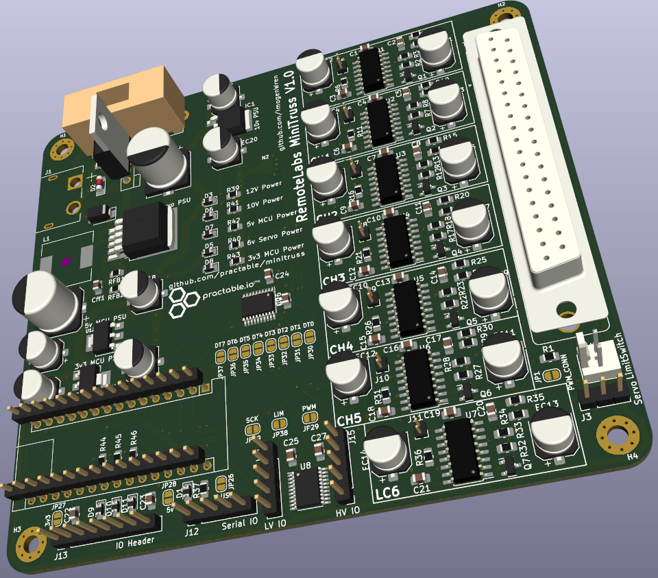

# truss

## Introduction

The truss remote laboratory has been designed for use with Structural Engineering and Engineering Design courses at the University of Edinburgh. The truss consists of 6 members, each with a full-bridge strain gauge arrangement using two biaxial strain gauges ([Kyowa KFGS-2-120-D16-11](./hw/docs/)). Strain gauge voltages are converted to digital signals using the [HX711 ADC](./hw/docs/) and this [HX711 library](https://www.arduino.cc/reference/en/libraries/hx711-arduino-library/) is used to read and tare the gauges. The truss is loaded using a [linear servo](./hw/docs/). 



## Contents

- [Firmware ./fw](./fw/)
- [Hardware ./hw](./hw/)
- [SBC ./sbc](./sbc/)
- [UI ./ui](./ui/)


## UI

User Interfaces have been designed with Vue3.js and built with Vite. There are currently three distinct versions of the UI ready to build:

- [default](./ui/default/): all data and components available on the user interface.
- [no-force](./ui/no-force/): force data is hidden for student calculation from strain data.
- [open-day](./ui/open-day/): simplified control interface for demonstrations.

## Changing control interface on UI

The differences in the above UI versions amount to very simple changes in the Vue files. 

The load force can be controlled with either a slider or simple buttons (as well experimental versions of a skeuomorphic display and gamepad control). Simply update the `loadControlVersion` parameter in `App.vue`.

```
loadControlVersion: 1,    //0 => input field, 1=> slider, 2=>simulation of physical knob, 3 => direct commands typed, 4 => GamePad, 5 => open day, simple buttons
```

To change whether the load force is displayed or the theoretical strains are available, update the boolean parameters in `src/modules/uiStore.js`:

```
show_force: false,       //should force values be displayed on the UI
show_theory: false,      //should the theoretical values component be available on the UI
```

## Firmware

The truss remote lab has been designed around the Arduino Nano 33 IoT. The firmware uses a state machine with 11 states, including reading, writing, taring and resetting strain gauges and moving the linear actuator. A single microcontroller performs both reading and writing of data. The state machine will remain in the READ state until a user command to change state. Upon performing that state the state machine will return to READ. The required libraries are included [here](./fw/libraries/). 

The firmware sends and receives JSON messages, eg:

Mode control, received from UI through Serial (for all commands see [SerialCommands](./fw/MiniTruss/):

```
{"set": "position", "to": value} 
{"set": "mode", "to": "move"} 
{"set": "mode", "to":"tare_all"} 
```

Sending data to UI through Serial:
```
{"load_cell":"20.0", "gauge_1": "100.0", "gauge_2": "100.0", "gauge_3": "100.0", "gauge_4": "100.0", "gauge_5": "100.0", "gauge_6": "100.0", "state":"1", "pos":"10"}
```

## PCB



The PCB requires a 12V input and provides output voltages for different components: 10V (load cell excitation voltage), 6V (linear actuator power) and 5V (strain gauge excitation voltage). Details of jumper requirements for setting up the PCB in different modes will be added (TODO).

## Hardware


The [Actuonix L16](./hw/docs/Actuonix+L16+Datasheet.pdf) linear actuator uses the custom library LinearServo for setting its position. It has a 50mm stroke length, but is limited in this remote lab to a maximum of 20% extension (providing around 150N of load on the truss).

## Re-calibration procedure

If a strain gauge value no longer reads an acceptable result (within your experimental tolerance) then the scale factor needs to be updated in the firmware.

- Note the value in micro-strain that the gauge is currently reading (current_value)
- Note the current scale factor for that gauge (current_factor)
- Calculate the value that you want it to read based on the load force (new_value)
- new_factor = current_value*current_factor / new_value

Using the debug UI (or any other means of sending a JSON command through Websocket to the experiment): send the new calibration data:

```
{"set":"cal","to":[2.0,2.1,2.2,2.3,2.4,2.5,2.6],"auth":"foo"}
```

Using the auth code that you set up initially.

Then reset to the STARTUP state so that the firmware loads the new calibration data:

```
{"set":"state","to":"STATE_STARTUP"}
```
